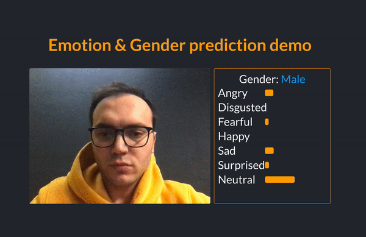

# Emotion and gender recognition
> Intenseye Bogazici University Tech Summit Workshop

This application is for demonstration of how to run deep learning models on the browser using javascript and Tensorflow.js



## Demo
_To run the demo please visit [https://intenseye.github.io/intenseye-boun-workshop/](https://intenseye.github.io/intenseye-boun-workshop/)._

## Development

This project was bootstrapped with [Create React App](https://github.com/facebook/create-react-app).
For more information about how to run it please visit the link.
In order to run the app in the development mode, you can run :

```sh
npm start
```

Open [http://localhost:3000](http://localhost:3000) to view it in the browser.
The page will reload if you make edits.
You will also see any lint errors in the console.
Multiple pretrained models are included in the repository as url.
In this repository we are using Keras models.
If you wish to use your own model you can reference to [this link](https://js.tensorflow.org/tutorials/import-keras.html)
to convert your own models.

## Intenseye

Intenseye is deep learning powered video analytics platform – [@intenseye](https://twitter.com/intenseye) – hello@intenseye.com
_For more information [https://intenseye.com/](https://intenseye.com/)._

## Contributing

1. Fork it (<https://github.com/yourname/yourproject/fork>)
2. Create your feature branch (`git checkout -b feature/fooBar`)
3. Commit your changes (`git commit -am 'Add some fooBar'`)
4. Push to the branch (`git push origin feature/fooBar`)
5. Create a new Pull Request

## Model Credit

For more information about how to train, obtain or understand these models you can check out this [awesome repository](https://github.com/oarriaga/face_classification)

